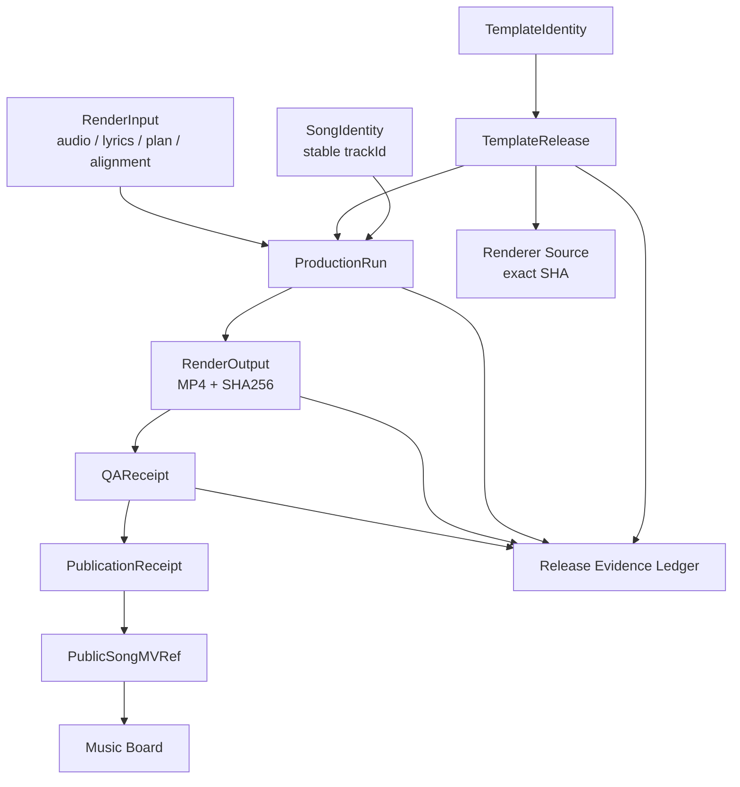
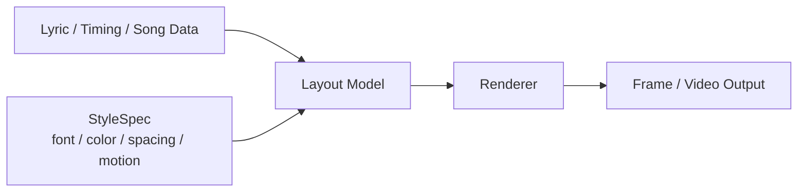

# Lyric MV 主线：理想架构、现状差距与执行 TODO

日期：2026-09-28

## 目标边界

本文件只服务歌词 MV 主线：

1. 《我拒绝被定义》是 canonical Aurora reference。
2. canonical template = `aurora-ribbon / F_aurora_ribbon`。
3. 已冻结 renderer/source revision = `7dbdfc3fc41f0e74d9ee775120b0da832ddf5dec`。
4. Cha-Cha Groove 是当前主动生产目标，必须基于该 exact revision 新建 immutable run、重渲、QA、发布。
5. BV1RFew6SE2H 是滚动歌词视觉参考，已经隔离为 experiment，不改变 production renderer。
6. Silence Still 只作为历史/独立记录。

## 当前事实

- canonical template 已进入 `REFERENCE_FROZEN`。
- `0090b18` / `2e5e3a8` 不可远端解析，不得作为 canonical renderer。
- renderer.py / styles.py 的历史证据表明当前 main `7dbdfc3` 与 2026-09-03 定稿日 renderer 字节一致。
- kit#18 已承担 Release Evidence Ledger。
- kit#15 已承担 renderer componentization / Data-UI separation。
- kit#20 已承担滚动歌词视觉 experiment。
- Workbench#14 承担 Cha-Cha 实际生产执行。

## 理想架构

## 数据 / Domain / UI 分离

### Domain

- SongIdentity
- TemplateIdentity
- TemplateRelease
- ProductionRun
- RenderInput
- RenderOutput
- QAReceipt
- PublicationReceipt

### Renderer component boundary

Renderer 不应从路径、branch name、目录名推断业务状态。

### Projection

- ReleaseEvidenceLedger
- PromotionAsset
- PublicTemplateRef
- PublicSongMVRef

### UI

UI 只消费 Projection / ViewModel，不直接读取 production run 文件夹推断状态。

## Current → Ideal

| 项目 | 当前 | 理想 | 差距 |
|---|---|---|---|
| canonical template | 已冻结 | immutable release 可被任何 run 引用 | 当前仍主要由 ledger + Issue 证明 |
| renderer | 可复现 | rendererSourceSHA 进入每个 run provenance | Cha-Cha 新 run 尚未实例化 |
| style | F_aurora_ribbon | typed StyleSpec | #15 componentization 尚未完成 |
| production run | Workbench contract 已定义 | 每次 run 都有 provenance.json | Cha-Cha C-1-9 待本机 |
| evidence | #18 ledger | 自动化 receipt 链 | 当前以治理/文档为主 |
| public projection | Music Board contract | 由 PublicationReceipt 驱动 | 新 asset 尚未到达 |
| UI | 部分历史路径驱动 | Domain → Projection → UI | 后续逐步收口 |

## 时间节点

- 2026-09-03：Aurora renderer 初始定稿证据。
- 2026-09-20：Cha-Cha historical run v20260920-01。
- 2026-09-23：Cha-Cha catalog pointer 修正。
- 2026-09-28：canonical provenance 冻结到 `7dbdfc3`。
- 2026-09-28：Workbench#14 建立新 run contract。
- 2026-09-28：kit#20 完成滚动歌词视觉实验。
- 下一节点：Workbench C-1-9 本机真实重渲。

## TODO

### P0

- [ ] Workbench C-1-9 使用 `7dbdfc3` 新建 immutable Cha-Cha run。
- [ ] 每次 render 前写 provenance.json。
- [ ] 记录 exact renderer/source SHA、inputs SHA、render command、output SHA256。
- [ ] 完成 ffprobe + visual QA + contact sheet。
- [ ] QA PASS 后才允许 publication。

### P1

- [ ] #18 ledger 增加 consumer readback。
- [ ] #15 完成 Data/Domain/StyleSpec/Renderer componentization。
- [ ] Music Board #89 消费新 publication receipt。
- [ ] Music Board #27 只使用 reviewed template facts。

### P2

- [ ] #13 文档 anchor 口径收敛。
- [ ] stale branch/source recovery 继续按 #16 证据门禁处理。
- [ ] 滚动歌词 experiment 独立演化，不直接升级为 APPROVED template。

## 不允许

- 不把 `0090b18` 当 canonical。
- 不把旧 MP4/B站 draft 当新生产结果。
- 不从 styleKey / branch / folder name 推断 release status。
- 不在 Cha-Cha render 中同时修改 renderer componentization。
