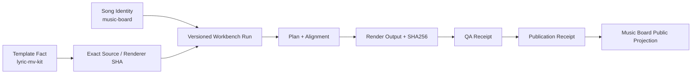

# 歌词 MV 版本化 Provenance 方案（2026-09-28）

## 目标

解决“到底哪个版本生产了什么内容”的核心问题。

当前必须区分：

1. Song Identity：歌曲是谁，由 Music Board canonical trackId 定义。
2. Template Identity：模板是什么，例如 `F_aurora_ribbon`。
3. Template/Renderer Source Revision：实际执行的 exact Git SHA。
4. Plan/Alignment Revision：本次歌曲具体时间轴/歌词版本。
5. Render Output：生成的 MP4 与 SHA-256。
6. Publication Asset：用于平台发布的确定性资产。
7. Consumer/Publication Receipt：平台实际接收并公开的版本。

## Canonical Reference

当前公开歌词 MV reference：

- 歌曲：《我拒绝被定义》
- NetEase：`netease-song-3422948585`
- B站：`BV1zRtX6WE5q`
- Aurora template/style：`F_aurora_ribbon`

注意：这是“canonical public reference”，不是“所有后续生产歌曲”。

## Active production

Cha-Cha Groove 仍是当前需要重新生产的歌曲。

正确关系：

```
《我拒绝被定义》
  = canonical template/reference example

Cha-Cha Groove
  = independent song
  = must consume exact approved template revision
  = new versioned render
```

## 禁止的推断

不得因为：
- 文件夹名字叫 `aurora-ribbon-v1`
- Issue 标题写 Aurora
- 历史 comment 提到某 SHA
- 某 PR 存在

就推断“这是当前 canonical released renderer”。

特别是历史证据中的 `0090b18` 当前无法由 GitHub remote 解析，应标记为“待核验”。

## 推荐数据模型

```yaml
templateId:
templateStatus:
sourceRepo:
sourceRef:
sourceSHA:
rendererPath:
styleKey:
canonicalReferenceTrackId:
approvedAt:
releasedAt:

runId:
trackId:
templateId:
templateSourceSHA:
rendererSourceSHA:
planSHA:
alignmentSHA:
audioSHA256:
lyricsSHA256:
renderCommand:
outputSHA256:
qaReceipt:
publicationReceipt:
```

## 理想状态



## 当前差距

| 维度 | 当前 | 理想 | 差距 |
|---|---|---|---|
| Song Identity | 有 stable trackId | stable trackId | 已具备 |
| Template Identity | 有 styleKey，但历史语义混杂 | reviewed templateId | P1 |
| Renderer Revision | 部分历史 SHA 不可恢复 | exact reachable SHA | P0 |
| Run Version | 历史 run 混有旧/新状态 | 新 run immutable | P0 |
| Output Identity | 有部分 SHA | 每次 render 必有 SHA | P0 |
| Publication Identity | 有 B站 draft | receipt 指向新 PASS asset | P0 |
| Cross-repo handoff | 多个旧 Issue | 单一协调 pointer | P0 |

## 本文边界

- 本文只定义 provenance / contract。
- 不执行本地渲染。
- 不上传媒体。
- 不修改平台账号/域名。
- 不删除历史 evidence。

## 时间节点

- 2026-09-20：Cha-Cha scaffold（历史）
- 2026-09-23：Cha-Cha v2 + B站 draft（历史）
- 2026-09-28：确定重新以 canonical template exact revision 重渲
- 下一节点：冻结 exact template revision → 新 run → QA → publication

## 关联

- lyric-mv-kit#13
- lyric-mv-kit#18
- lyric-mv-workbench-private#10
- lyric-mv-workbench-private#14
- lyric-mv-workbench-private#11 / PR#11
- music-board#27
- music-board#87
- music-board#89
- music-board#92
- product-hub#150
- product-hub#152
